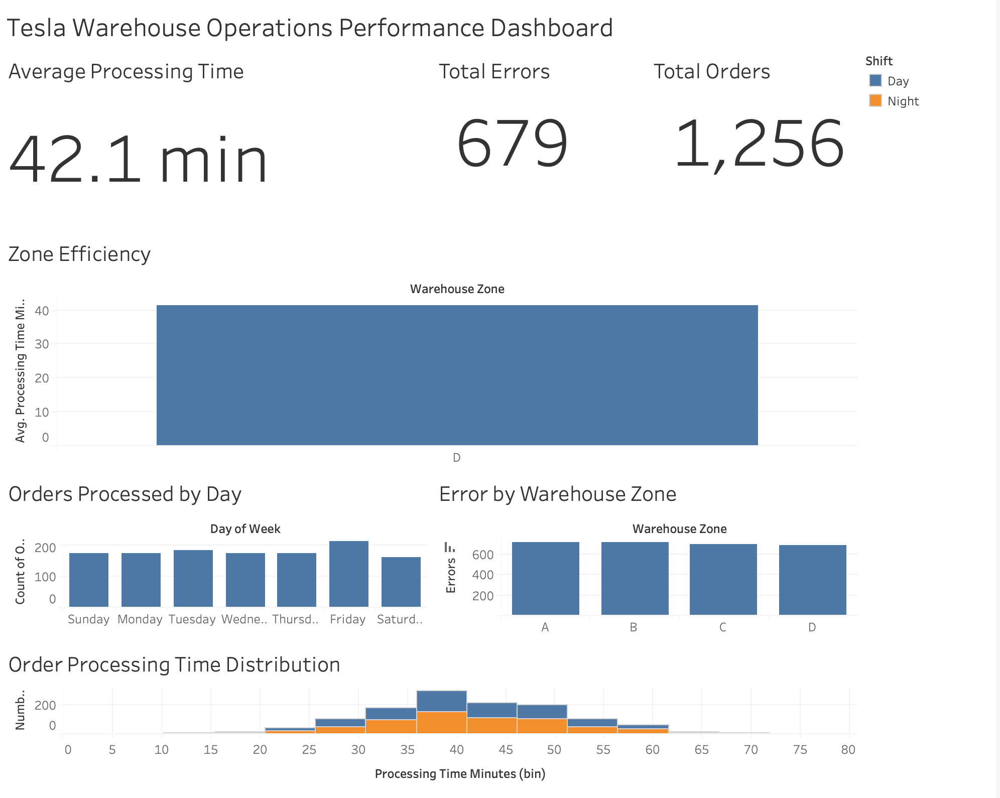

# Tesla Warehouse Operations Dashboard

Supply chain analytics and Six Sigma project analyzing warehouse efficiency, processing time, and operational errors using **SQL, Python, and Tableau**.

---

# Project Overview

This project analyzes warehouse order processing performance to identify operational inefficiencies and improvement opportunities.

The analysis follows **Six Sigma DMAIC methodology** and uses modern data analytics tools.

Technologies used:

* **SQL** → Operational data analysis
* **Python** → Statistical modeling and simulation
* **Tableau** → Executive dashboard visualization

---

# Dashboard Preview



---

# Dataset

The dataset simulates warehouse order processing operations including:

* Order ID
* Warehouse zone
* Picker ID
* Items picked
* Processing time
* Errors
* Shift
* Day of week

Dataset file:

```
tesla_warehouse_orders_5000.csv
```

---

# SQL Operational Analysis

SQL queries were used to analyze warehouse performance metrics including:

* Average order processing time
* Error rates by warehouse zone
* Orders processed by day
* Picker performance analysis

SQL script:

```
tesla_warehouse_analysis.sql
```

---

# Python Data Analysis

Python was used to perform deeper statistical analysis and modeling.

### Core analysis script

```
tesla_warehouse_analysis.py
```

### Pareto Analysis

Identifies the warehouse zones responsible for the majority of operational errors using the **80/20 principle**.

```
pareto_analysis.py
```

### Regression Modeling

Builds a statistical model to predict processing time based on operational variables such as:

* Items picked
* Shift
* Warehouse zone

```
regression_model.py
```

### Monte Carlo Simulation

Simulates thousands of warehouse processing scenarios to estimate future performance variability and risk.

```
monte_carlo_simulation.py
```

---

# Tableau Executive Dashboard

The interactive dashboard visualizes operational insights including:

* Orders processed by day
* Error rates by warehouse zone
* Processing time trends
* Picker efficiency comparison

This dashboard allows decision-makers to quickly identify bottlenecks and performance gaps.

---

# What This Project Demonstrates

This project demonstrates **real Six Sigma Black Belt analytics capabilities**:

* DMAIC methodology
* SQL operational analysis
* Python statistical modeling
* Pareto root cause analysis
* Control charts
* Process improvement planning
* Executive dashboard reporting

---

# Project Structure

```
tesla-warehouse-operations-dashboard
│
├── tesla_warehouse_orders_5000.csv
├── tesla_warehouse_analysis.sql
├── tesla_warehouse_analysis.py
├── pareto_analysis.py
├── regression_model.py
├── monte_carlo_simulation.py
├── tesla_dashboard.png
└── README.md
```

---

# Tools & Technologies

* SQL
* Python
* Pandas
* NumPy
* Scikit-learn
* Tableau
* Data Visualization
* Supply Chain Analytics
* Six Sigma

---

# Author
Alfred Quenum
Data Analytics & Operations Optimization Portfolio Project
